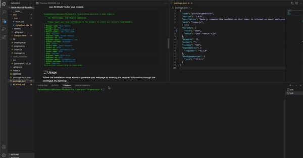

     

# Team Profile Generator
---
## Table of Content 

* [Description](#description)
* [Technlogies](#technologies)
* [Usage](#usage)
* [Installation](#installation)
* [Testing](#testing)
* [Contributors](#contributors)
* [License](#license)
* [Contribution](#contribution)
* [Questions](#questions)

## 📝 Description
This app generates a webage that displays your team project's basic information, with links to their emails, GitHub profiles and other relevant information using a command-line application. This project has taught me how to implement unit testing to ensure that the codes functionality is operating correctly. 

## 🕹 Technologies used 

- HTML
- Bootstrap
- JavaScript
- Node.js
- Inquirer
- Jest Unit Testing

## ⚙️ Installation 
*You can find a step-by-step tutorial [here](https://github.com/Raimeeab/team-profile-generator/blob/main/dist/demos/Walkthrough.mov)*

1. Git clone this repository onto your local machine and navigate to the file on your terminal. *This can also be done by opening the file on Visual Studios and running it through the intergated terminal.*

2. In order for the app to function correctly, ensure you have the latest or most stable version of Node.js and that you've run:

    - `npm install`

3. Run `node index.js` and follow the prompts that run on your terminal. This will then generate your very own README file for your project. 

## 🖥 Usage 
Follow the installation steps above to generate your webpage by entering the required information through the command-line terminal. 
- If you wish to do multiple webpages, please keep in mind that the file will overwrite itself if the file name is the same. The default name is "index.html".
- If you do not have all the information needed at the time of creating the app, simply keep those prompts empty and add them directly in your HTML file at a later time. 

## 🎛 Testing
Use Unit Testing with Jest: 
- Run `npm run test` in your terminal

## 👥 Contributors

*[Raimee Abbassi](https://github.com/Raimeeab)*  
*The Univserity of Sydney | Trilogy Education Services*  

## 🔖 License

MIT License
Copyright (c) [2021] [profile-generator]
Permission is herby granted, free of charge, to any person obtaining a copy of this software and associated documentation files (the "Software"), to deal in the Software without restriction, including without limiation the rights to use, copy, modify, merge, publish, distribute, sublicense, and/or sell copies of the Software, and to permit persons to whom the Software is furnished to do so, subject following coditions: 
The above copyright notice and this permission notice shall be included in all copies or substantial portions of the Software. 

THE SOFTWARE IS PROVIDED "AS IS", WITHOUT WARRANTY OF ANY KIND, EXPRESS OR IMPLIED, INCLUDING BUT NOT LIMITED TO THE WARRANTIES OF MECHANTABILITY, FITNESS FOR A PARTICULAR PURPOSE AND NONINFRINGEMENT. IN NO EVENT SHALL THE AUTHORS OR COPYRIGHT HOLDERS BE LIABLE FOR ANY CLAIM, DAMAGES OR OTHER LIABILITY, WHETHER IN AN ACTION OF CONTRACT, TORT OR OTHERWISE, ARISING FROM, OUT OF OR IN CONNECTION WITH THE SOFTWARE OR THE USE OF OTHER DEALINGS IN THE SOFTWARE.  

---

## 🤝 How to Contribute

For information on how to contribute, please follow the guidlelines listed in [Contributor Covenant](https://www.contributor-covenant.org/).

## ❓ Questions
If you have any questions, contact me via [email](raimee.abbassi@gmail.com). You can also find more of my work [here](https://github.com/Raimeeab).

